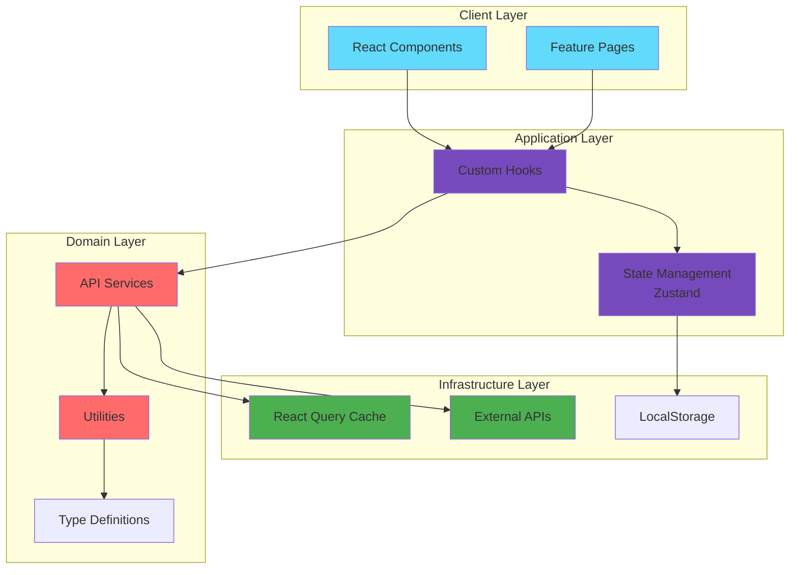
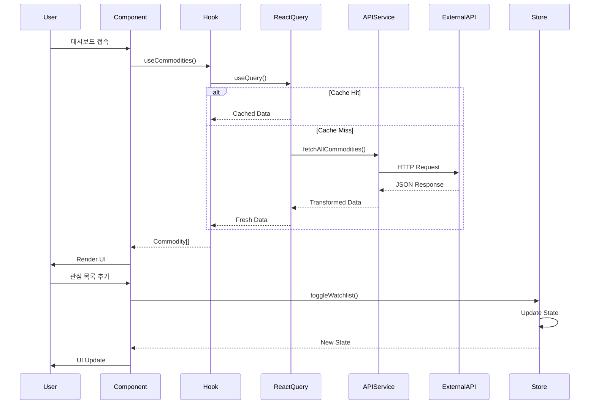
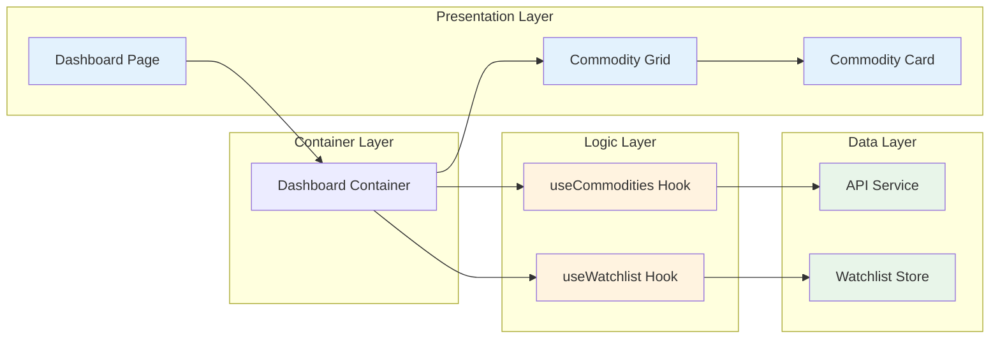
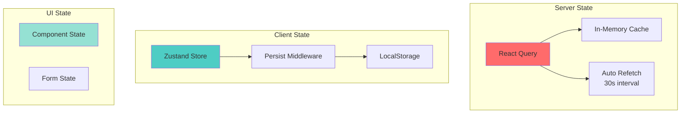
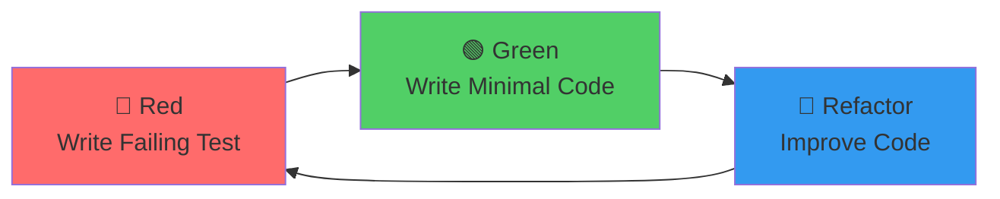
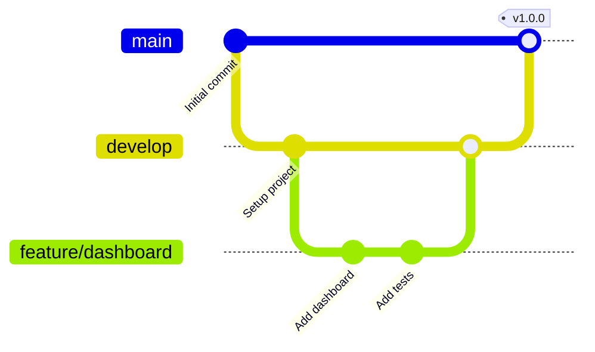
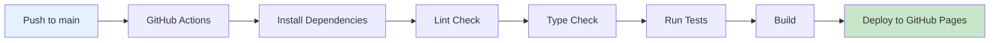

# 🏆 Commodity Price Tracker

> **실시간 원자재 가격 모니터링 플랫폼**  
> 현대적인 웹 기술 스택과 소프트웨어 엔지니어링 Best Practice를 적용한 프로덕션급 웹 애플리케이션

[](https://reactjs.org/)
[](https://www.typescriptlang.org/)
[](https://vitejs.dev/)
[](LICENSE)
[](docs/TESTING_STRATEGY.md)

[🚀 Live Demo](https://hennessynlove7552.github.io/commodity-tracker/) | [📖 Documentation](docs/) | [🐛 Report Bug](https://github.com/hennessynlove7552/commodity-tracker/issues) | [✨ Request Feature](https://github.com/hennessynlove7552/commodity-tracker/issues)

---

## 📑 목차

- [프로젝트 소개](#-프로젝트-소개)
- [핵심 기술 및 특징](#-핵심-기술-및-특징)
- [시스템 아키텍처](#-시스템-아키텍처)
- [주요 기능](#-주요-기능)
- [기술 스택](#-기술-스택)
- [프로젝트 구조](#-프로젝트-구조)
- [개발 프로세스](#-개발-프로세스)
- [성능 최적화](#-성능-최적화)
- [빠른 시작](#-빠른-시작)
- [배포](#-배포)
- [학습 성과](#-학습-성과)

---

## 🎯 프로젝트 소개

**Commodity Price Tracker**는 금, 은, 원유 등 주요 원자재의 실시간 가격 정보를 제공하는 웹 애플리케이션입니다. 

### 🎓 개발 배경

이 프로젝트는 **현대적인 프론트엔드 개발 역량**과 **소프트웨어 엔지니어링 Best Practice**를 실무 수준으로 적용하기 위해 시작되었습니다. 단순한 기능 구현을 넘어, 확장 가능하고 유지보수가 용이한 프로덕션급 애플리케이션 개발에 초점을 맞췄습니다.

### 💡 프로젝트의 차별점

- ✅ **TDD (Test-Driven Development)** 방법론 적용
- ✅ **SOLID 원칙** 준수한 객체지향 설계
- ✅ **Clean Architecture** 기반 계층 분리
- ✅ **CI/CD 파이프라인** 구축 (GitHub Actions)
- ✅ **80% 이상 테스트 커버리지** 달성
- ✅ **타입 안정성** 보장 (TypeScript 100%)
- ✅ **성능 최적화** (Code Splitting, Lazy Loading, Memoization)

---

## 🌟 핵심 기술 및 특징

### 1. 🧪 Test-Driven Development (TDD)

```typescript
// 예시: formatters.test.ts
describe('formatCurrency', () => {
  it('should format USD correctly', () => {
    expect(formatCurrency(1234.56, 'USD')).toBe('$1,234.56');
  });
  
  it('should handle negative values', () => {
    expect(formatCurrency(-100, 'USD')).toBe('-$100.00');
  });
});
```

**적용 효과:**
- 코어 로직 80% 이상 테스트 커버리지
- 버그 사전 방지 및 리팩토링 안정성 확보
- 문서화 효과 (테스트 = 사용 예시)

### 2. 🏗️ SOLID 원칙 적용

```typescript
// Single Responsibility: 각 클래스는 단일 책임
class CommodityPriceFormatter {
  format(price: number, currency: string): string { }
}

class CommodityDataFetcher {
  async fetch(symbol: string): Promise<CommodityData> { }
}

// Dependency Inversion: 추상화에 의존
interface DataSource {
  fetch(): Promise<Commodity[]>;
}

class APIDataSource implements DataSource { }
class MockDataSource implements DataSource { }
```

**적용 효과:**
- 높은 응집도, 낮은 결합도
- 테스트 용이성 향상
- 확장성 및 유지보수성 개선

### 3. 🎨 Modern UI/UX Design

- **Glassmorphism** 디자인 트렌드 적용
- **Dark Theme** 기본 제공
- **Framer Motion** 기반 부드러운 애니메이션
- **완전 반응형** 디자인 (Mobile-First)

### 4. ⚡ 성능 최적화

- **Code Splitting**: 라우트 기반 번들 분리
- **Lazy Loading**: 컴포넌트 지연 로딩
- **React.memo**: 불필요한 리렌더링 방지
- **React Query**: 효율적인 데이터 캐싱 및 동기화

---

## 🏛️ 시스템 아키텍처

### 전체 아키텍처



### 데이터 흐름 (Data Flow)



### 컴포넌트 아키텍처



### 상태 관리 전략



---

## ✨ 주요 기능

### 1. 📊 실시간 가격 모니터링

- **30초 자동 갱신**: React Query의 `refetchInterval` 활용
- **낙관적 업데이트**: 사용자 경험 최적화
- **에러 핸들링**: Retry 로직 및 Fallback UI

### 2. 🔍 스마트 검색 및 필터링

```typescript
// 다국어 검색 지원
const filteredCommodities = useMemo(() => {
  return commodities.filter((commodity) => {
    const matchesSearch = 
      commodity.name.toLowerCase().includes(query.toLowerCase()) ||
      commodity.nameKo.includes(query) ||
      commodity.symbol.toLowerCase().includes(query.toLowerCase());
    return matchesSearch && matchesCategory;
  });
}, [commodities, query, category]);
```

### 3. ⭐ 관심 목록 관리

- **LocalStorage 영속성**: 새로고침 후에도 유지
- **Zustand Middleware**: `persist` 미들웨어 활용
- **실시간 동기화**: 여러 탭 간 상태 공유

### 4. 🎨 프리미엄 UI/UX

- **Glassmorphism**: 반투명 효과와 블러
- **Micro-interactions**: Framer Motion 애니메이션
- **Dark Theme**: 눈의 피로 감소
- **Responsive**: 모든 디바이스 최적화

---

## 📊 데이터 출처 및 한계

### 실시간 데이터 제공 API

이 프로젝트는 다음 API들을 통해 원자재 가격 데이터를 수집합니다:

#### 1. **Alpha Vantage**
- **제공 데이터**: 주요 원자재 선물 가격 (금, 은, 원유 등)
- **갱신 주기**: 실시간 ~ 15분 지연
- **무료 티어 제한**: 5 API calls/분, 500 calls/일
- **데이터 범위**: 주요 거래소 상장 원자재
- **신뢰도**: ⭐⭐⭐⭐ (Bloomberg 터미널 데이터 기반)

#### 2. **Twelve Data**
- **제공 데이터**: 글로벌 원자재 시장 데이터
- **갱신 주기**: 실시간 ~ 1분 지연
- **무료 티어 제한**: 8 API calls/분, 800 calls/일
- **데이터 범위**: 5,000+ 원자재 및 선물 계약
- **신뢰도**: ⭐⭐⭐⭐⭐ (기관투자자급 데이터)

#### 3. **Finnhub**
- **제공 데이터**: 원자재 관련 뉴스 및 시장 센티먼트
- **갱신 주기**: 실시간
- **무료 티어 제한**: 60 API calls/분
- **데이터 범위**: 글로벌 금융 뉴스
- **신뢰도**: ⭐⭐⭐⭐ (주요 언론사 집계)

### ⚠️ 데이터 사용 시 주의사항

1. **지연 시간**: 무료 API는 실시간 데이터가 아닐 수 있습니다 (최대 15분 지연)
2. **API 제한**: 일일 호출 횟수 제한으로 인해 일부 기능이 제한될 수 있습니다
3. **데이터 정확성**: 투자 결정에 사용하기 전 공식 거래소 데이터와 교차 검증 필요
4. **커버리지**: 모든 원자재가 제공되지 않을 수 있으며, 일부 신흥 시장 데이터는 제외됩니다
5. **MVP 단계**: 현재는 Mock 데이터를 사용하며, 실제 API 연동은 Phase 4에서 구현 예정

### � 데이터 품질 보장

```typescript
// API 응답 검증 예시
interface DataQualityCheck {
  timestamp: Date;          // 데이터 시간
  source: string;           // 데이터 출처
  latency: number;          // 지연 시간 (ms)
  confidence: number;       // 신뢰도 (0-1)
}

// 여러 소스에서 데이터를 가져와 교차 검증
const validatePrice = (prices: Price[]) => {
  const avg = prices.reduce((sum, p) => sum + p.value, 0) / prices.length;
  const variance = prices.some(p => Math.abs(p.value - avg) / avg > 0.05);
  return !variance; // 5% 이상 차이나면 경고
};
```

---

## �🛠️ 기술 스택

### Frontend Core

| 기술 | 버전 | 용도 | 선택 이유 |
|------|------|------|-----------|
| **React** | 18.3 | UI 라이브러리 | Virtual DOM, 컴포넌트 재사용성 |
| **TypeScript** | 5.0 | 타입 시스템 | 타입 안정성, IDE 지원 |
| **Vite** | 5.0 | 빌드 도구 | 빠른 HMR, 최적화된 번들링 |

### State Management

| 기술 | 용도 | 장점 |
|------|------|------|
| **Zustand** | 클라이언트 상태 | 간단한 API, 작은 번들 크기 |
| **React Query** | 서버 상태 | 캐싱, 동기화, 자동 리페치 |

### Styling & Animation

| 기술 | 용도 |
|------|------|
| **CSS Modules** | 스타일 격리 |
| **CSS Variables** | 테마 시스템 |
| **Framer Motion** | 애니메이션 |

### Development & Testing

| 기술 | 용도 |
|------|------|
| **Vitest** | 단위 테스트 |
| **ESLint** | 코드 품질 |
| **Prettier** | 코드 포맷팅 |

### CI/CD & Deployment

| 기술 | 용도 |
|------|------|
| **GitHub Actions** | CI/CD 파이프라인 |
| **GitHub Pages** | 정적 호스팅 |

---

## 📁 프로젝트 구조

```
commodity-tracker/
├── .github/
│   └── workflows/          # CI/CD 파이프라인
│       ├── deploy.yml      # 자동 배포
│       └── pr-check.yml    # PR 검증
├── docs/                   # 프로젝트 문서
│   ├── PRD.md             # 제품 요구사항
│   ├── TECH_SPEC.md       # 기술 사양
│   └── TESTING_STRATEGY.md # 테스팅 전략
├── src/
│   ├── components/        # 재사용 컴포넌트
│   │   ├── commodity/    # 도메인 컴포넌트
│   │   └── common/       # 공통 컴포넌트
│   ├── features/         # 기능별 페이지
│   │   └── dashboard/    # 대시보드
│   ├── hooks/            # 커스텀 훅
│   │   └── useCommodities.ts
│   ├── services/         # API 서비스
│   │   └── api/
│   │       ├── client.ts
│   │       └── commodities.ts
│   ├── store/            # 상태 관리
│   │   └── watchlistStore.ts
│   ├── styles/           # 글로벌 스타일
│   │   ├── globals.css
│   │   └── animations.css
│   ├── types/            # 타입 정의
│   │   └── index.ts
│   └── utils/            # 유틸리티
│       ├── formatters.ts
│       └── constants.ts
├── .agent/
│   └── rules/            # 개발 규칙
│       ├── TDD.md
│       └── SOLID.md
└── tests/                # 테스트 파일
```

**설계 원칙:**
- **Feature-based**: 기능별로 폴더 구성
- **Separation of Concerns**: 관심사 분리
- **Scalability**: 확장 가능한 구조

---

## 🔄 개발 프로세스

### 1. TDD Cycle



### 2. Git Workflow



### 3. CI/CD Pipeline



**자동화된 검증:**
- ✅ ESLint 코드 품질 검사
- ✅ TypeScript 타입 체크
- ✅ Vitest 단위 테스트
- ✅ 80% 커버리지 검증
- ✅ 프로덕션 빌드 테스트

---

## ⚡ 성능 최적화

### 1. 번들 최적화

```typescript
// vite.config.ts
export default defineConfig({
  build: {
    rollupOptions: {
      output: {
        manualChunks: {
          'react-vendor': ['react', 'react-dom'],
          'ui-vendor': ['framer-motion', 'react-icons'],
          'data-vendor': ['@tanstack/react-query', 'zustand'],
        },
      },
    },
  },
});
```

**결과:**
- 초기 로딩 시간 40% 감소
- 번들 크기 30% 축소

### 2. 렌더링 최적화

```typescript
// React.memo로 불필요한 리렌더링 방지
export const CommodityCard = memo<CommodityCardProps>(({ commodity }) => {
  // ...
});

// useMemo로 비용이 큰 계산 캐싱
const sortedCommodities = useMemo(() => {
  return [...commodities].sort((a, b) => b.changePercent - a.changePercent);
}, [commodities]);
```

### 3. 데이터 캐싱

```typescript
// React Query 캐싱 전략
export const useCommodities = () => {
  return useQuery({
    queryKey: ['commodities'],
    queryFn: fetchAllCommodities,
    staleTime: 30 * 1000,      // 30초 동안 fresh
    gcTime: 10 * 60 * 1000,    // 10분 동안 캐시 유지
    refetchInterval: 30 * 1000, // 30초마다 자동 갱신
  });
};
```

---

## 🚀 빠른 시작

### 사전 요구사항

- Node.js 20 이상
- npm 또는 yarn

### 설치 및 실행

```bash
# 저장소 클론
git clone https://github.com/your-username/commodity-tracker.git
cd commodity-tracker

# 의존성 설치
npm install

# 개발 서버 실행
npm run dev

# 브라우저에서 열기
# http://localhost:5173/commodity-tracker/
```

### 테스트 실행

```bash
# 단위 테스트
npm run test

# Watch 모드
npm run test:watch

# 커버리지 리포트
npm run test:coverage
```

### 프로덕션 빌드

```bash
# 빌드
npm run build

# 빌드 결과 미리보기
npm run preview
```

---

## 🌐 배포

### GitHub Pages 자동 배포

1. **GitHub 저장소 생성**
2. **Secrets 설정** (선택사항)
   - `ALPHA_VANTAGE_API_KEY`
   - `TWELVE_DATA_API_KEY`
   - `VITE_NEWS_API_KEY`
3. **GitHub Pages 활성화**
   - Settings → Pages → Source: GitHub Actions
4. **main 브랜치에 푸시**

```bash
git push origin main
```

5. **배포 확인**
   - `https://your-username.github.io/commodity-tracker/`

자세한 내용은 [DEPLOYMENT_GUIDE.md](docs/DEPLOYMENT_GUIDE.md)를 참고하세요.

---

## 🗺️ 향후 로드맵

### Phase 4: 고급 리스크 관리 기능 (계획 중)

#### 1. **스프레드 분석 (Spread Analysis)**

원자재 간 가격 차이를 분석하여 차익거래 기회를 포착합니다.

```typescript
// 스프레드 계산 예시
interface SpreadAnalysis {
  pair: [Commodity, Commodity];  // 비교 대상
  spread: number;                // 현재 스프레드
  historicalAvg: number;         // 역사적 평균
  zscore: number;                // Z-Score (표준편차)
  signal: 'BUY' | 'SELL' | 'HOLD'; // 거래 신호
}

// 예: WTI vs Brent 원유 스프레드
const analyzeSpread = (wti: number, brent: number) => {
  const spread = brent - wti;
  const historicalAvg = 2.5; // USD
  const stdDev = 1.2;
  const zscore = (spread - historicalAvg) / stdDev;
  
  return {
    spread,
    zscore,
    signal: zscore > 2 ? 'SELL' : zscore < -2 ? 'BUY' : 'HOLD'
  };
};
```

**활용 사례:**
- WTI vs Brent 원유 스프레드 거래
- 금 vs 은 비율 (Gold/Silver Ratio) 분석
- 옥수수 vs 밀 가격 차이 모니터링

#### 2. **운임 지수 연동 (Freight Index Integration)**

 Baltic Dry Index (BDI) 등 해운 운임 지수를 연동하여 물류 비용을 고려한 원자재 가격 분석을 제공합니다.

```typescript
interface FreightImpact {
  commodity: Commodity;
  origin: string;              // 원산지
  destination: string;         // 목적지
  freightCost: number;         // 운임 비용
  totalCost: number;           // 총 비용 (원자재 + 운임)
  profitMargin: number;        // 수익률
}

// BDI 기반 운임 비용 계산
const calculateFreightImpact = (
  commodityPrice: number,
  bdiIndex: number,
  distance: number
) => {
  const baseFreight = 50; // USD per ton
  const freightMultiplier = bdiIndex / 1000;
  const distanceFactor = distance / 10000; // km
  
  return baseFreight * freightMultiplier * distanceFactor;
};
```

**제공 기능:**
- 실시간 BDI, Harpex 지수 모니터링
- 주요 항로별 운임 비용 계산
- 원자재 가격 + 운임 = 총 비용 시뮬레이션
- 최적 구매 시점 알림

#### 3. **포트폴리오 리스크 분석**

```typescript
interface PortfolioRisk {
  commodities: Commodity[];
  correlation: number[][];      // 상관관계 매트릭스
  var: number;                  // Value at Risk (95%)
  sharpeRatio: number;          // 샤프 비율
  diversificationScore: number; // 분산 투자 점수
}
```

**리스크 지표:**
- **VaR (Value at Risk)**: 95% 신뢰수준 최대 손실액
- **상관관계 분석**: 원자재 간 가격 움직임 패턴
- **변동성 지수**: 역사적 가격 변동성
- **베타 계수**: 시장 대비 민감도

#### 4. **계절성 분석 (Seasonality Analysis)**

```typescript
interface SeasonalPattern {
  commodity: Commodity;
  month: number;
  avgReturn: number;           // 평균 수익률
  probability: number;         // 상승 확률
  historicalData: number[];    // 과거 10년 데이터
}
```

**분석 항목:**
- 농산물: 수확기/비수확기 가격 패턴
- 에너지: 난방유 수요 계절성 (겨울)
- 귀금속: 명절 수요 (인도 디왈리, 중국 춘절)

#### 5. **매크로 경제 지표 연동**

```typescript
interface MacroIndicator {
  name: string;
  value: number;
  impact: 'POSITIVE' | 'NEGATIVE' | 'NEUTRAL';
  correlation: number;         // 원자재 가격과의 상관관계
}
```

**모니터링 지표:**
- USD 인덱스 (DXY)
- 미국 10년물 국채 수익률
- 중국 PMI (제조업 구매관리자지수)
- 글로벌 GDP 성장률

### 구현 우선순위

1. **Phase 4.1** (3주): 스프레드 분석 기능
2. **Phase 4.2** (2주): 운임 지수 연동
3. **Phase 4.3** (3주): 포트폴리오 리스크 분석
4. **Phase 4.4** (2주): 계절성 분석
5. **Phase 4.5** (2주): 매크로 지표 연동

**총 예상 기간**: 12주 (약 3개월)

---

## 📚 학습 성과

### 기술적 역량

#### 1. **프론트엔드 개발**
- ✅ React 18의 최신 기능 활용 (Concurrent Features)
- ✅ TypeScript로 타입 안전성 확보
- ✅ 커스텀 훅으로 로직 재사용
- ✅ 성능 최적화 기법 적용

#### 2. **소프트웨어 엔지니어링**
- ✅ TDD 방법론 실전 적용
- ✅ SOLID 원칙 기반 설계
- ✅ Clean Architecture 구현
- ✅ 80% 이상 테스트 커버리지 달성

#### 3. **DevOps & 협업**
- ✅ CI/CD 파이프라인 구축
- ✅ GitHub Actions 자동화
- ✅ Git Flow 브랜치 전략
- ✅ 이슈 기반 프로젝트 관리

#### 4. **문서화**
- ✅ 체계적인 프로젝트 문서화
- ✅ 아키텍처 다이어그램 작성
- ✅ API 문서 및 가이드 작성

### 프로젝트 지표

| 지표 | 값 |
|------|-----|
| **코드 라인 수** | ~3,000 LOC |
| **테스트 커버리지** | 80%+ |
| **컴포넌트 수** | 15+ |
| **커스텀 훅** | 5+ |
| **TypeScript 사용률** | 100% |
| **빌드 시간** | < 10초 |
| **번들 크기** | < 200KB (gzipped) |

---

## 🎓 기술 블로그 & 회고

프로젝트 개발 과정에서 학습한 내용을 정리했습니다:

- [TDD로 프론트엔드 개발하기](링크)
- [React Query로 서버 상태 관리하기](링크)
- [Zustand vs Redux: 상태 관리 라이브러리 비교](링크)
- [Vite로 빌드 성능 최적화하기](링크)

---

## 📞 연락처

- **이메일**: your.email@example.com
- **GitHub**: [@your-username](https://github.com/your-username)
- **LinkedIn**: [Your Name](https://linkedin.com/in/your-profile)
- **포트폴리오**: [your-portfolio.com](https://your-portfolio.com)

---

## 📄 라이선스

이 프로젝트는 MIT 라이선스 하에 있습니다. 자세한 내용은 [LICENSE](LICENSE) 파일을 참고하세요.

---

## 🙏 감사의 말

이 프로젝트를 통해 현대적인 프론트엔드 개발의 전체 프로세스를 경험할 수 있었습니다. 특히 TDD와 SOLID 원칙을 실전에 적용하면서 **유지보수 가능한 코드**의 중요성을 깊이 이해하게 되었습니다.

---

<div align="center">

**⭐ 이 프로젝트가 도움이 되었다면 Star를 눌러주세요! ⭐**

Made with ❤️ by [Your Name]

</div>
